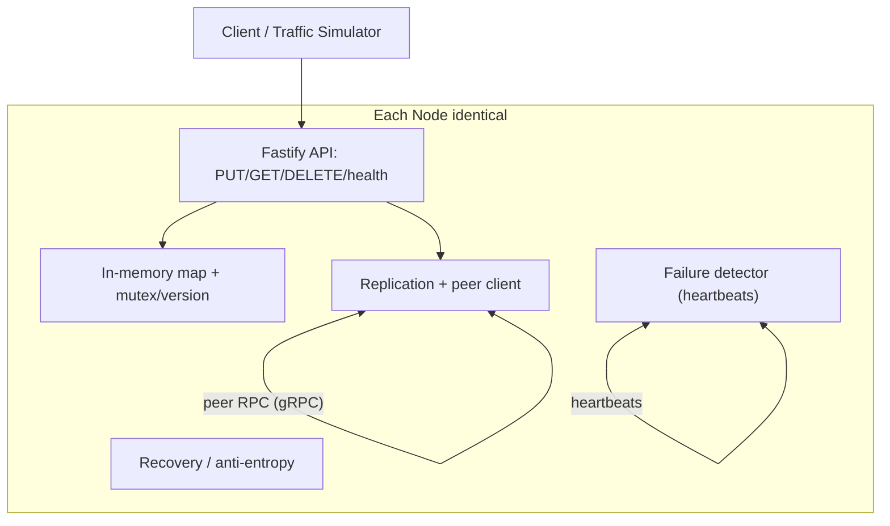
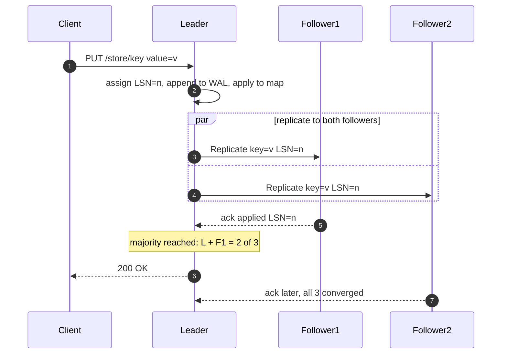
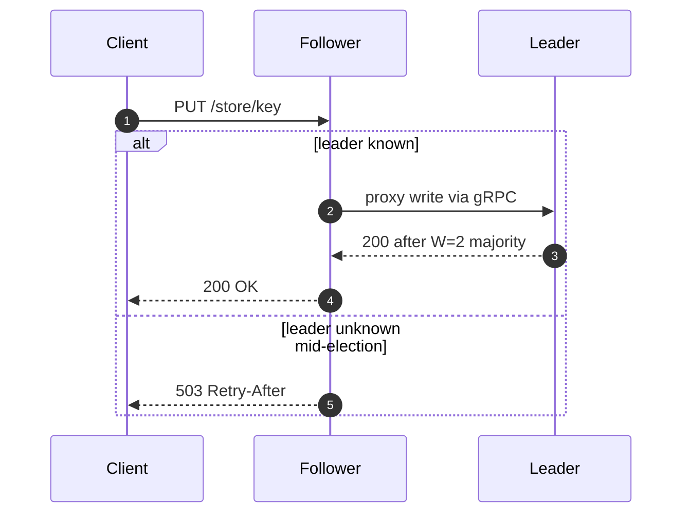
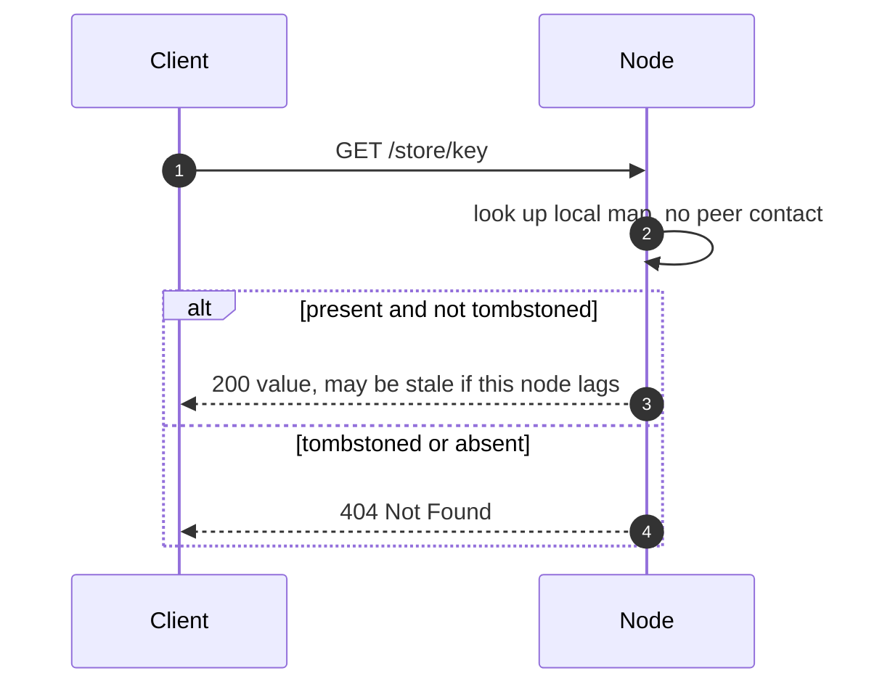
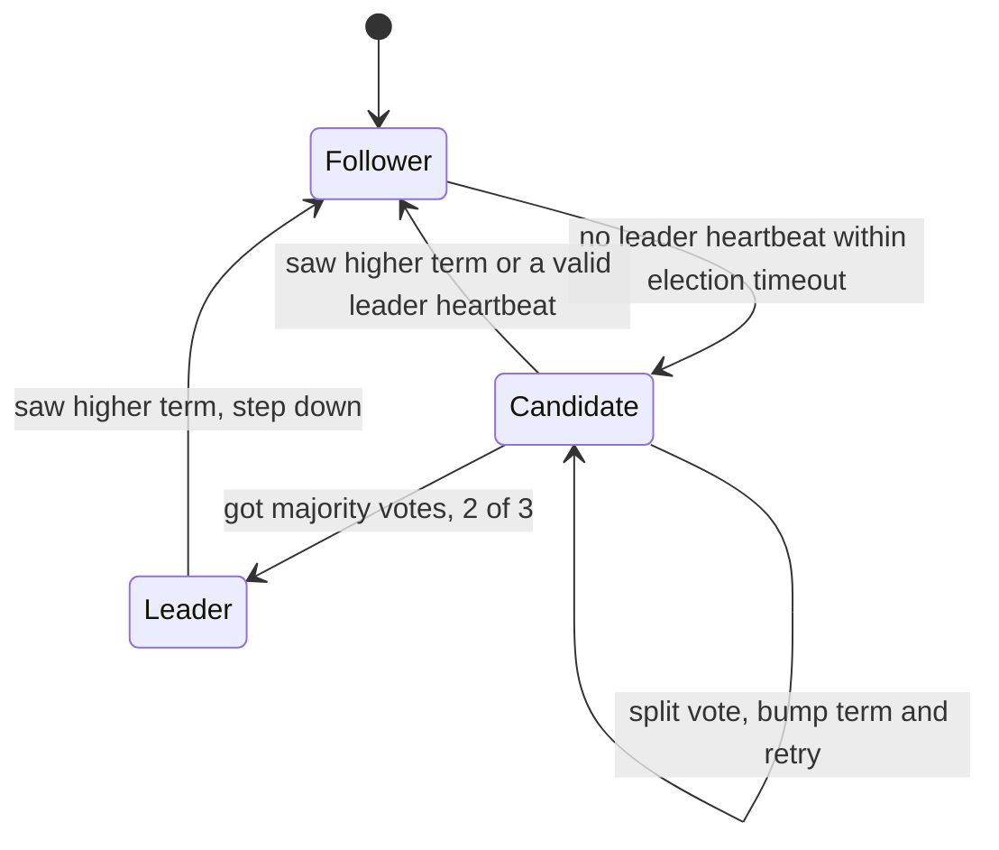
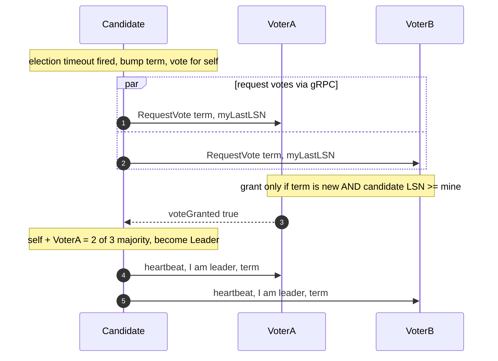

# Hackathon Walkthrough: Distributed KV Store (Learn-by-Doing)

This is a guided walkthrough, not a do-it-for-you plan. Each phase has tasks you execute and **Decision Points** I will debate with you when you reach them. Confirmed choices so far: **Node/TypeScript**, **Fastify** for the client API, **hybrid deployment** (docker-compose graded + 3-VM realism track), **single-leader (master/slave) topology**, **followers redirect writes to the leader internally** (server-side proxy), and **Raft-lite majority-vote leader election**, **gRPC inter-node transport**, and a **per-node append-only log with version(LSN)-based delta resync**.

## Guiding principles (read first)
- "In-memory" means each node holds its **own** map in RAM. Data appears everywhere only because **you replicate it over the network**. Nothing is shared.
- The node image must be **deployment-agnostic**: identity + peers come from env (`NODE_ID`, `PEERS`, `PORT`), never hardcoded. Same image runs in compose and on VMs.
- Spend "first-principles" effort on **replication / failure detection / recovery**, not on the HTTP layer.
- Design before code. Commit frequently. Keep a fallback working commit.

## Architecture (target mental model)

## Phase 1 flows (write / read / election)

**Write path (W=2 majority-ack):** leader stamps an LSN, appends to WAL, applies, fans out to both followers, returns `200` after the FIRST follower ack (leader + 1 = majority). Third node catches up async.

**Write landing on a follower:** proxy to leader server-side; `503` retryable if leader unknown.

**Read path (R=1, eventual):** answer from local map, no peer contact; may be stale; tombstone reads as 404. (Strong read = route to leader or R=2 so W+R > N.)

**Leader election (Raft-lite):** missed heartbeats -> bump term, self-vote, request votes; grant only if term is new AND candidate LSN >= voter's last LSN (up-to-date-log rule -> makes W=2 durability safe, prevents split-brain). Majority 2/3 wins.

## Phase 0 - Pre-hackathon prep
- Cloud account + ability to SSH into a VM (you'll need 3 micro VMs for the realism track).
- Local toolchain: Node LTS, Docker + Docker Compose.
- Skim 1-2 readings from the doc (Notes for Young Bloods + CAP FAQ).
- Repo skeleton: TypeScript project, `Dockerfile`, `.gitignore` (node_modules, .env, *.key), `.env.example`.

## Phase 1 - Design before code (~20 min, paper first)
- Draw the architecture and the **write path** and **read path** on paper.
- **Decision Point A - Inter-node protocol** (DECIDED: gRPC): typed `.proto` service for replication + heartbeats + vote RPCs; first-class deadlines help Chaos Hour. Budget ~30-45 min Node/TS setup (`@grpc/grpc-js` + `@grpc/proto-loader` or `ts-proto`). Note: gRPC runs on HTTP/2 on TCP. Client-facing API stays Fastify/HTTP per the contract.
- **Decision Point B - Replication strategy** (DECIDED: single-leader / master-slave): one writer -> total order -> no write conflicts. Followers **redirect writes to the leader internally** (server-side proxy, NOT an HTTP 3xx to the client; return `503` retryable if leader unknown mid-election). Failover via **Raft-lite majority vote** (see Stage 3).
- **Decision Point C - Consistency model** (DECIDED: hybrid - W=2 majority-ack writes + R=1 eventual follower reads): leader applies locally, fans out to BOTH followers, blocks only on the FIRST follower ack (leader + 1 = majority = 2), then returns `200`. The third node may still lag, so a read from any single follower (R=1) can be stale and converge later. Quorum math: W=2 + R=1 = 3, NOT > N=3 -> eventual by design (R=2 would make reads strong). Availability payoff: one follower can be slow/dead and writes still succeed. Sentence: "Acknowledged writes are durable on a majority; follower reads are eventually consistent because W+R is not greater than N."
- **Decision Point D - Persistence** (DECIDED: per-node append-only log + version-based delta resync): leader assigns a monotonic log sequence number (LSN) to every write/delete. Recovery = follower sends its highest applied LSN, leader streams entries after it (delta); full-snapshot fallback if the follower is too far behind. Each key also stores its last LSN so re-applies are idempotent and convergence is deterministic (a key's version = the LSN of its last write).

## Phase 2 - Implementation by stage

### Stage 1 - Hello, Distributed World
- Fastify server with `PUT/GET/DELETE/store/:key` + `GET /health` against a local in-memory map (mutex-guarded; store value + a version/timestamp for later conflict handling).
- Config loader from env (`NODE_ID`, `PORT`, `PEERS`).
- Peer heartbeat loop (interval ping; track alive/dead per peer). **Decision Point E (DECIDED: tune via env)** - starting values: heartbeat every ~250ms, election/dead timeout randomized in [1000ms, 2000ms] (several x the heartbeat to avoid false positives from one dropped beat; randomized to avoid tie votes). Env knobs: `HEARTBEAT_MS`, `ELECTION_TIMEOUT_MIN_MS`, `ELECTION_TIMEOUT_MAX_MS`. Trade-off: too short = flapping/false failovers; too long = slow failover.
- Milestone: PUT then GET on one node; all 3 nodes log seeing each other.

### Stage 2 - Replication & Consistency
- Implement the write path per your Decision B/C (replicate to peers, count acks, handle a slow/unreachable peer with timeouts).
- Implement the read path (from leader / any replica / quorum).
- Handle concurrent same-key writes per your conflict rule (LWW via version/timestamp is the simplest defensible choice; we'll debate).
- Model DELETE as a **tombstone** (a versioned delete marker in the log), NOT a raw map removal - otherwise a lagging replica or a resync can **resurrect** a deleted key. Reads treat a tombstone as 404. GC tombstones after a grace period (or keep them for the hackathon).
- Milestone: PUT on A, GET correct value from B; you can state your consistency guarantee in one sentence.

### Stage 3 - Chaos Hour (design in advance)
- Make every peer call **timeout-bounded** and non-blocking; degrade, don't hang.
- `/health` must report degraded/role state when peers are unreachable.
- Don't lose acknowledged writes; make writes **idempotent** (client-supplied write id or version) so retries are safe.
- Address split-brain via Raft-lite: minority partition can't win a majority vote -> can't elect a leader; a stale leader that rejoins sees a higher term and steps down. Implement: term/epoch counter, 2/3 majority votes, leader heartbeats to suppress elections, randomized election timeout to avoid tie votes.
- IMPORTANT (makes W=2 durability real): only grant a vote if the candidate's log is at least as up-to-date as yours, so a lagging node can't win and silently drop an acknowledged write.
- Milestone: one node killed -> remaining nodes keep serving, no data loss.

### Stage 4 - Recovery & Load
- Recovery/anti-entropy per Decision D: restarted node replays its own on-disk log, then requests entries after its highest LSN from the leader (delta resync); full-snapshot fallback if too far behind.
- Back-pressure under load (bounded concurrency; shed load gracefully rather than crash).
- Milestone: kill node -> write 200 keys -> restart -> recovered node has all data; survive 60s load < 5% errors.

## Phase 3 - Testing (local, before chaos)
- Unit-ish: write-then-read across nodes; concurrent writes resolve deterministically.
- Manual chaos via compose: `docker kill`, `docker pause`, `docker network disconnect`, `docker start` and observe behavior.
- A small script to write N keys and verify reads from each node (mirrors the grader).

## Phase 4 - Deployment (hybrid)
- **Graded artifact - docker-compose**: 3 node services + the organizer's `chaos-agent` (Docker socket mounted), ports 8081-8083 + 9090. This matches the orchestrator's single chaos endpoint and is the safety net (failed cloud deploy is graded locally, capped 80/100).
- **Realism track - 3 VMs**: same image on each VM, `PEERS` set to the other VMs' IP:port, firewall opens KV ports + 9090 to organizer, SSH from you. One chaos sidecar per VM (per-host agent is the real prod pattern; note the multi-endpoint trade-off vs the grader).
- Document the 3-VM divergence in **your own README** (not the organizer's spec): why 3 VMs, how chaos differs, what you'd improve.

## Phase 5 - Design review prep
- README: build/run, consistency model (1 sentence), replication strategy (1 paragraph), known limitations.
- Be ready to answer: "what happens when node B dies mid-write?" and "two clients write the same key at once?"
- Prepare an honest self-assessment (weakest part + how you'd fix it) - it's worth 10 points.

## Decisions log (yours to own; I debate, not decide)
- **DECIDED** Topology (B): single-leader (master/slave). Rationale: one writer -> total order -> no write conflicts.
- **DECIDED** Write routing: followers redirect writes to the leader internally (server-side proxy; `503` retryable if leader unknown).
- **DECIDED** Failover: Raft-lite majority-vote election (term counter + 2/3 votes + leader heartbeats + randomized election timeout).
- **DECIDED** Transport (A): gRPC for inter-node RPC (replication/heartbeat/vote); Fastify/HTTP stays for the client API.
- **DECIDED** Consistency (C): hybrid - W=2 majority-ack writes (durability) + R=1 eventual follower reads. W+R=3 is not > N=3, so reads are eventual by design. Requires up-to-date-log vote restriction in election to hold the durability guarantee.
- **DECIDED** Persistence (D): per-node append-only log; recovery via version(LSN)-based delta resync, snapshot fallback.
- **DECIDED (tunable)** Failure detection (E): heartbeat ~250ms, election timeout randomized [1000-2000ms], via env. Tune during chaos testing.
- **TODO (implementation-time)** Data model: versioned DELETE tombstones (avoid resurrection); idempotency/write-id for retries; `/health` reports role (leader|follower|candidate).